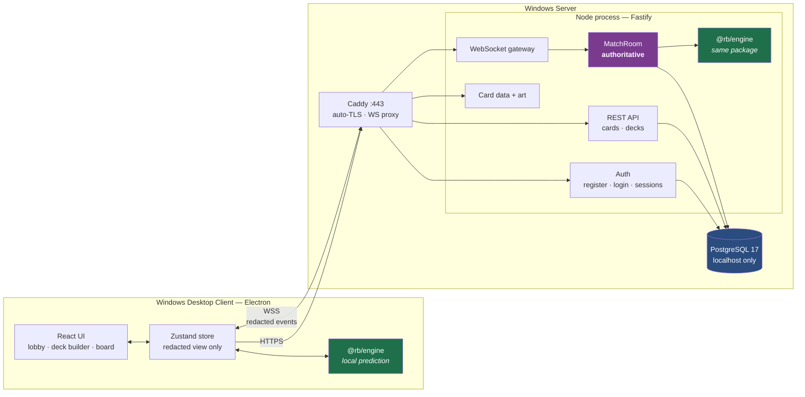
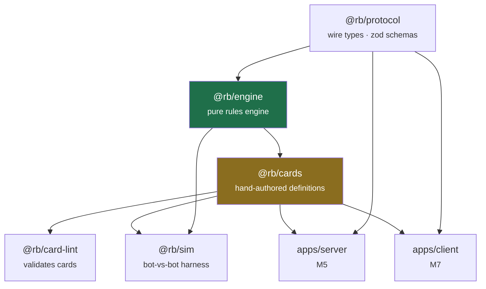
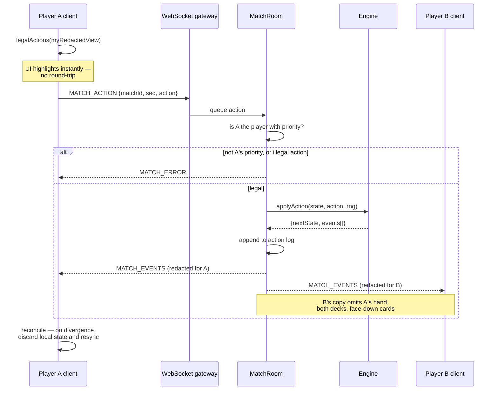
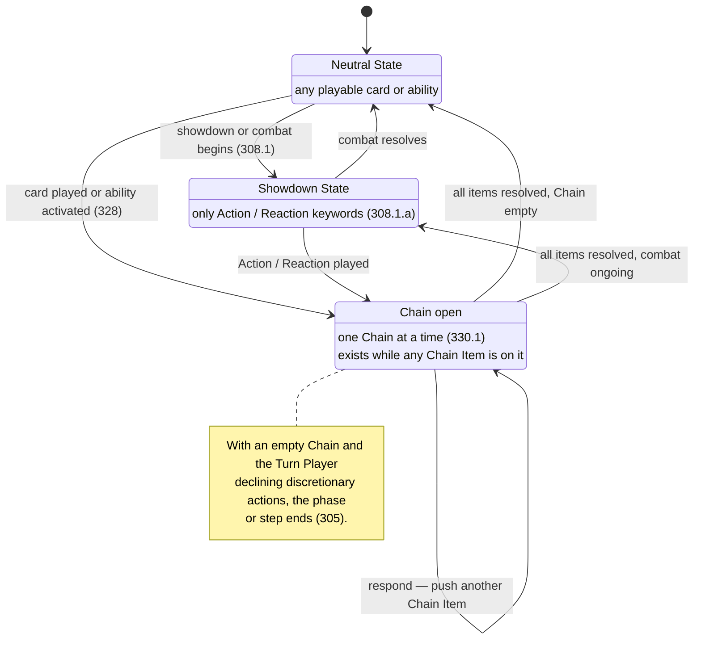
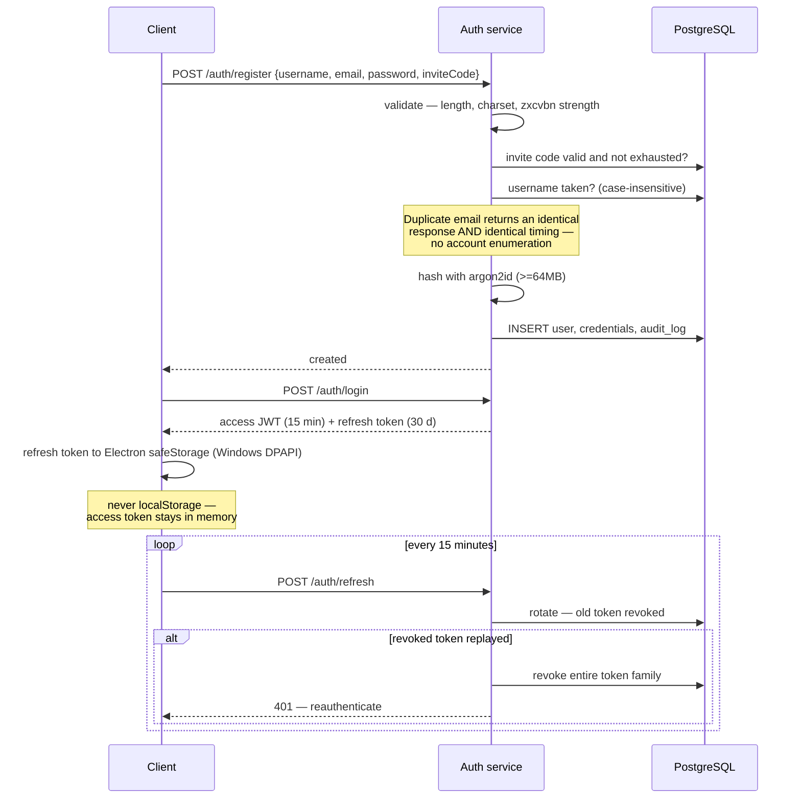
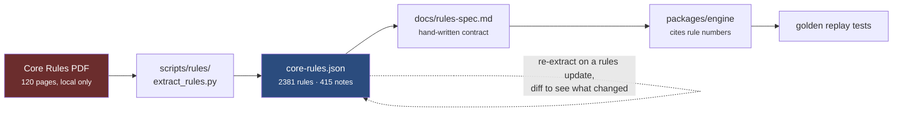

# Architecture

Diagrams for how Riftbound Online fits together. Rule numbers in parentheses cite
Riot's Core Rules via the corpus described in
[docs/reference/README.md](reference/README.md).

---

## 1. System overview

One Windows box runs everything. Caddy terminates TLS and proxies both HTTP and
WebSocket traffic to a single Node process; PostgreSQL is bound to localhost and
never exposed.

The two green boxes are **the same TypeScript package**. The server runs it as the
source of truth; the client runs it over its redacted view to resolve legal moves
with no round-trip. Writing the rules once is the reason the whole stack is
TypeScript.

---

## 2. Package dependencies

Dependencies only ever point **downward into the engine**. Nothing the engine
depends on can perform I/O, which is what keeps it deterministic — ESLint enforces
this by banning `Math.random`, `Date.now`, timers and Node imports inside
`packages/engine`.

---

## 3. An action, end to end

This is the anti-cheat core. The server never trusts the client's claim about
whose turn it is, and each player receives a view redacted for them individually.

Actions are serialised one at a time — the engine is synchronous and never sees
concurrency. A match persists as `{seed, actions[]}`, so replaying the log
reproduces the game exactly. That single property gives replays, spectating,
reconnection and crash recovery without extra machinery.

---

## 4. Turn states and the chain

Grounded in the extracted rules, not guessed. The full phase table is transcribed
in `docs/rules-spec.md` (M1, in progress).

Player choices made _during_ resolution — targeting, modal picks, "you may" — are
the single largest source of bugs in a TCG engine. The engine never blocks or
awaits: it emits `PENDING_CHOICE` and suspends until a `RESOLVE_CHOICE` arrives
from that specific player.

---

## 5. Registration and session lifetime

Registration happens inside the desktop client — there is no website. Invite-code
mode is the default: no SMTP to run, and a small community server stays closed to
strangers and bots.

---

## 6. How Riot's rulebook becomes engine code

The extractor exists because `pdftotext -layout` loses the pairing between a rule's
left-column number and its indented body, which makes the numbers useless. Working
from word bounding boxes and re-pairing by baseline recovers **99.99%** of the
document's text against correct rule numbers.

Riot's PDF and everything derived from it are gitignored. Only the extractor is
committed.
